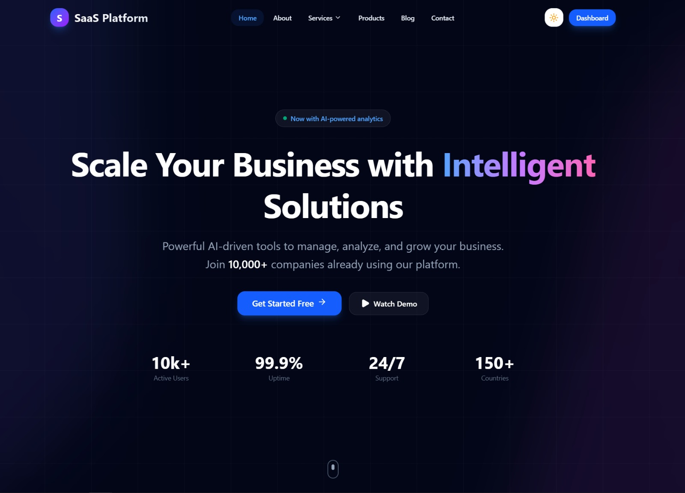

<p align="center">
  
</p>

<h1 align="center">🚀 BoilerPlateNextjs</h1>
<p align="center">
  A production-ready, highly modular Next.js boilerplate for scalable SaaS applications.
</p>

<p align="center">
  
  
  
  
  
</p>

---

## 📖 Table of Contents

- [Overview](#-overview)
- [Architecture](#-architecture)
- [Project Structure](#-project-structure)
- [Tech Stack](#-tech-stack)
- [Getting Started](#-getting-started)
- [Scripts](#-scripts)
- [Features](#-features)
- [Component Design System](#-component-design-system)
- [Route Groups](#-route-groups)
- [Performance & Best Practices](#-performance--best-practices)
- [Contributing](#-contributing)

---

## 🎯 Overview

**BoilerPlateNextjs** is an enterprise-grade foundation for building modern SaaS platforms. It implements a **Domain-Driven Layout strategy** that cleanly separates public marketing pages from authenticated application logic, ensuring your codebase scales gracefully as your product grows.

> Built with Next.js 16, React 19, Tailwind CSS v4, and a rich animation stack.

---

## 🏗 Architecture

This boilerplate follows a strict separation of concerns. Every folder has a single responsibility, making the codebase predictable and easy to navigate.

### Key Architectural Decisions

| Decision | Rationale |
|----------|-----------|
| **Route Groups** | Separates `(website)` and `(dashboard)` without polluting the URL structure |
| **Atomic Component Folders** | Components grouped by responsibility, not by page |
| **Context Providers** | Modular global state (Auth, Theme, Dashboard) — no prop drilling |
| **Custom Hooks** | All data-fetching and business logic lives in `hooks/` |

---

## 📂 Project Structure

```
BoilerPlateNextjs/
├── README.md
├── eslint.config.mjs
├── jsconfig.json
├── next.config.mjs
├── package.json
├── postcss.config.mjs
├── public/
│   ├── file.svg
│   ├── globe.svg
│   ├── next.svg
│   ├── vercel.svg
│   ├── window.svg
│   └── wireImage.png          ← Your project banner/logo
│
└── src/
    ├── app/
    │   ├── (dashboard)/         # 🔒 Authenticated App Shell & Routes
    │   │   ├── analytics/
    │   │   ├── dashboard/
    │   │   │   └── products/
    │   │   ├── settings/
    │   │   ├── users/
    │   │   └── layout.jsx
    │   │
    │   ├── (website)/           # 🌐 Public Marketing Shell & Routes
    │   │   ├── about/
    │   │   ├── blog/
    │   │   ├── contact/
    │   │   ├── products/
    │   │   ├── services/
    │   │   ├── page.jsx          # Landing page
    │   │   └── layout.jsx
    │   │
    │   ├── favicon.ico
    │   ├── globals.css
    │   └── layout.jsx
    │
    ├── components/
    │   ├── animations/          # Framer Motion & GSAP orchestration
    │   │   ├── MotionWrapper.jsx
    │   │   └── ScrollReveal.jsx
    │   ├── cards/               # Reusable card components
    │   │   ├── FeatureCard.jsx
    │   │   ├── ProductCard.jsx
    │   │   ├── StatsCard.jsx
    │   │   └── UserCard.jsx
    │   ├── charts/              # Data visualization (Recharts)
    │   │   ├── AreaChart.jsx
    │   │   ├── BarChart.jsx
    │   │   ├── LineChart.jsx
    │   │   └── PieChart.jsx
    │   ├── common/              # Atomic UI primitives
    │   │   ├── Avatar.jsx
    │   │   ├── Badge.jsx
    │   │   ├── Button.jsx
    │   │   ├── Dropdown.jsx
    │   │   ├── Input.jsx
    │   │   ├── Loader.jsx
    │   │   ├── Modal.jsx
    │   │   └── ThemeToggle.jsx
    │   ├── dashboard/           # Internal app components
    │   │   ├── AnalyticsOverview.jsx
    │   │   ├── DashboardStats.jsx
    │   │   ├── RecentActivity.jsx
    │   │   └── UserManagement.jsx
    │   ├── layout/              # Cross-cutting layout components
    │   │   ├── DashboardHeader.jsx
    │   │   ├── DashboardLayout.jsx
    │   │   ├── DashboardLayoutWrapper.jsx
    │   │   ├── Footer.jsx
    │   │   ├── Header.jsx
    │   │   ├── Navbar.jsx
    │   │   ├── Sidebar.jsx
    │   │   └── WebsiteLayout.jsx
    │   ├── media/
    │   │   └── ImageWithText.jsx
    │   ├── sections/            # Marketing page sections
    │   │   ├── AboutSection.jsx
    │   │   ├── CTASection.jsx
    │   │   ├── ContactSection.jsx
    │   │   ├── FeaturesSection.jsx
    │   │   ├── HeroSection.jsx
    │   │   ├── PricingSection.jsx
    │   │   └── TestimonialsSection.jsx
    │   └── tables/              # Data tables
    │       ├── DataTable.jsx
    │       ├── TableHeader.jsx
    │       └── TableRow.jsx
    │
    ├── context/                 # Global state providers
    │   ├── AuthContext.jsx
    │   ├── DashboardContext.jsx
    │   └── ThemeContext.jsx
    │
    ├── hooks/                   # Reusable logic
    │   ├── useAuth.js
    │   ├── useDashboard.js
    │   └── useFetch.js
    │
    └── lib/                     # Core utilities
        ├── axios.js
        ├── constants.js
        └── helpers.js
```

---

## 🛠 Tech Stack

| Layer | Technology | Version |
|-------|------------|---------|
| **Framework** | Next.js (App Router) | `^16.2.10` |
| **UI Library** | React | `19.2.7` |
| **Styling** | Tailwind CSS | `^4.3.2` |
| **Animations** | Framer Motion | `^12.42.2` |
| **Animations** | GSAP + @gsap/react | `^3.15.0` |
| **Charts** | Recharts | `^3.9.2` |
| **Icons** | Lucide React | `^0.564.0` |
| **HTTP Client** | Axios | `^1.18.1` |
| **State** | React Context API | Built-in |
| **Linting** | ESLint + eslint-config-next | `^9` |

---

## 🚀 Getting Started

### Prerequisites

- **Node.js** 18.x or higher
- **npm** / **pnpm** / **yarn**

### Installation

```bash
# 1. Clone the repository
git clone <your-repo-url>

# 2. Navigate into the project
cd BoilerPlateNextjs

# 3. Install dependencies
npm install

# 4. Start the development server
npm run dev
```

Your app will be running at [http://localhost:3000](http://localhost:3000) 🎉

---

## 📜 Scripts

| Script | Command | Description |
|--------|---------|-------------|
| `dev` | `npm run dev` | Start Next.js development server |
| `build` | `npm run build` | Build for production |
| `start` | `npm run start` | Start production server |
| `lint` | `npm run lint` | Run ESLint across the project |

---

## ✨ Features

### 🌐 Website (Public Routes)
- **Landing Page** — Hero, Features, Pricing, Testimonials, CTA sections
- **About** — Company story and team
- **Blog** — Content marketing pages
- **Contact** — Lead capture form
- **Products** — Product showcase
- **Services** — Service offerings

### 🔒 Dashboard (Authenticated Routes)
- **Analytics** — Data-driven insights with charts
- **Dashboard Home** — Overview with stats cards and recent activity
- **Products** — Product management interface
- **Settings** — User preferences and configuration
- **Users** — User management and administration

### 🎨 UI & UX
- ✅ **Dark / Light Theme Toggle** — Seamless theme switching via `ThemeContext`
- ✅ **Smooth Animations** — Scroll reveals, page transitions, micro-interactions
- ✅ **Responsive Design** — Mobile-first Tailwind CSS approach
- ✅ **Reusable Component Library** — Consistent design language across the app
- ✅ **Data Visualization** — Charts and tables for dashboard analytics

---

## 🧩 Component Design System

Components are organized by **Atomic Responsibility**:

| Folder | Responsibility | Examples |
|--------|---------------|----------|
| `common/` | **Atoms** — Stateless, highly reusable primitives | Button, Input, Badge, Modal |
| `cards/` | **Molecules** — Composite card components | FeatureCard, ProductCard, StatsCard |
| `sections/` | **Organisms** — Full page sections for marketing | HeroSection, PricingSection, CTASection |
| `layout/` | **Templates** — Cross-cutting layout shells | Navbar, Sidebar, Footer, DashboardLayout |
| `dashboard/` | **Domain-specific** — Internal app features | AnalyticsOverview, UserManagement |
| `charts/` | **Data viz** — Chart wrappers | AreaChart, BarChart, PieChart |
| `tables/` | **Data display** — Table components | DataTable, TableHeader |
| `animations/` | **Motion** — Animation wrappers | MotionWrapper, ScrollReveal |

---

## 🗺 Route Groups

This project leverages **Next.js Route Groups** to create distinct application contexts:

| Group | Path Pattern | Purpose |
|-------|-------------|---------|
| `(website)` | `/about`, `/blog`, `/contact`, `/products`, `/services` | Public marketing pages with SEO optimization |
| `(dashboard)` | `/analytics`, `/dashboard`, `/settings`, `/users` | Authenticated app with dedicated layout |

> 💡 **Why Route Groups?** They allow different layouts (e.g., a marketing navbar vs. a dashboard sidebar) without adding segments to the URL.

---

## ⚡ Performance & Best Practices

| Practice | Implementation |
|----------|---------------|
| **Code Splitting** | Heavy components (Charts, Modals) use dynamic imports to reduce initial bundle size |
| **GPU-Accelerated Animations** | Centralized `MotionWrapper` ensures smooth 60fps transitions |
| **Nested Layouts** | Next.js nested layouts prevent unnecessary re-renders of Sidebars/Navbars during navigation |
| **Optimized Fonts** | `next/font` for zero CLS (Cumulative Layout Shift) |
| **Reusable Hooks** | All data-fetching logic encapsulated in `useAuth`, `useFetch`, `useDashboard` |
| **Modular Context** | Each provider has a single responsibility — no bloated global state |

---

## 🤝 Contributing

We welcome contributions! When adding new features, please follow these guidelines:

### 📁 Where to add files

| What you're adding | Where it goes |
|-------------------|---------------|
| New UI primitive (Button, Input, etc.) | `src/components/common/` |
| New marketing section | `src/components/sections/` |
| New dashboard feature | `src/components/dashboard/` |
| New data-fetching logic | `src/hooks/` |
| New global state | `src/context/` (keep it focused!) |
| New utility/helper | `src/lib/` |

### 📝 Code Style

- Follow the existing ESLint configuration
- Use Tailwind CSS utility classes for styling
- Extract complex logic into custom hooks
- Keep components small and focused on a single responsibility

---

<p align="center">
  Built with ❤️ using <a href="https://nextjs.org">Next.js</a> & <a href="https://tailwindcss.com">Tailwind CSS</a>
</p>